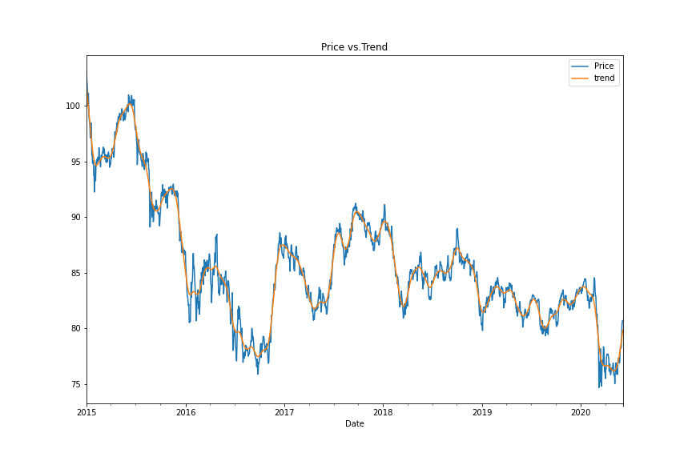

# Time-series Models for forecasting movement in currencies
The use of Time Series tools to predict future movements in the value of two currencies.

## Background

Most financial institutions and large companies importing and exporting goods globally are always interested in the best action to be taken to get the lowest exchange rate to maximize profits. For this, it is important to be able to understand the future direction and risk of various currencies.

This piece of work applies many time series tools to predict future movements in the value of Canadian Dollar versus the Japanese Yen.

## Time Series Analysis and Forecasting

Historical CAD-JPY exchange rate data was used and time series analysis and modeling applied to determine any predictable behaviour.

1. Hodrick-Prescott filter: Decomposing the settle price into trend and noise. 

Smoothing with the HP Filter and plotting the resulting trend against the actual futures returns, there's a lot of short term fluctuations that deviate around this trend. This could represent profitable trading opportunities, e.g. when the blue line deviates far below the orange, we can see this as a sign that the Yen is temporarily more undervalued than it should be (and, therefore, we'd see this as a short-term buying opportunity).

2. ARMA model: Forecasting returns.

3. ARIMA model: Forecasting the exchange rate price.

In the short term, the model forecasts a decrease in the value/price of Yen, but with that said, the P-values of the model are not lower than 0.05, thus the model is not reliable.

4. GARCH model: Forecasting near-term volatility.

The p-values for GARCH and volatility forecasts tend to be much lower than our ARMA/ARIMA return and price forecasts. In particular, here we have all p-values of less than 0.05, except for alpha(2), indicating overall a much better model performance. 

## Linear Regression Forecasting

Use Scikit-Learn linear regression model to predict CAD/JPY returns with *lagged* CAD/JPY futures returns and categorical calendar seasonal effects (e.g., day-of-week or week-of-year seasonal effects)

1. Data preparation (creating returns and lagged returns, and splitting the data into training and testing data)
2. Fitting a linear regression model.
3. Making predictions using the testing data.

4. Out-of-sample and In-sample performance.
  When comparing RMSE betwen out-of-sample and in-sample performance, the RMSE for in-sample performance is expected to be lower than out-of-sample performance data, but in this case the out-of-sample RMSE (0.64) is lower than the in-sample RMSE (0.83). 
No I will not feel confident using these models for trading.

## Files

[Time-Series Starter Notebook](time_series_analysis.ipynb)

[Linear Regression Starter Notebook](regression_analysis.ipynb)

[CAD/JPY Data CSV File](cad_jpy.csv)
